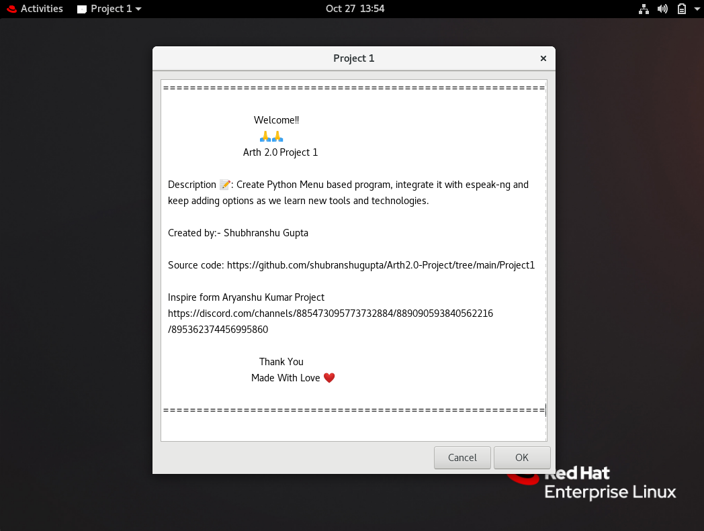
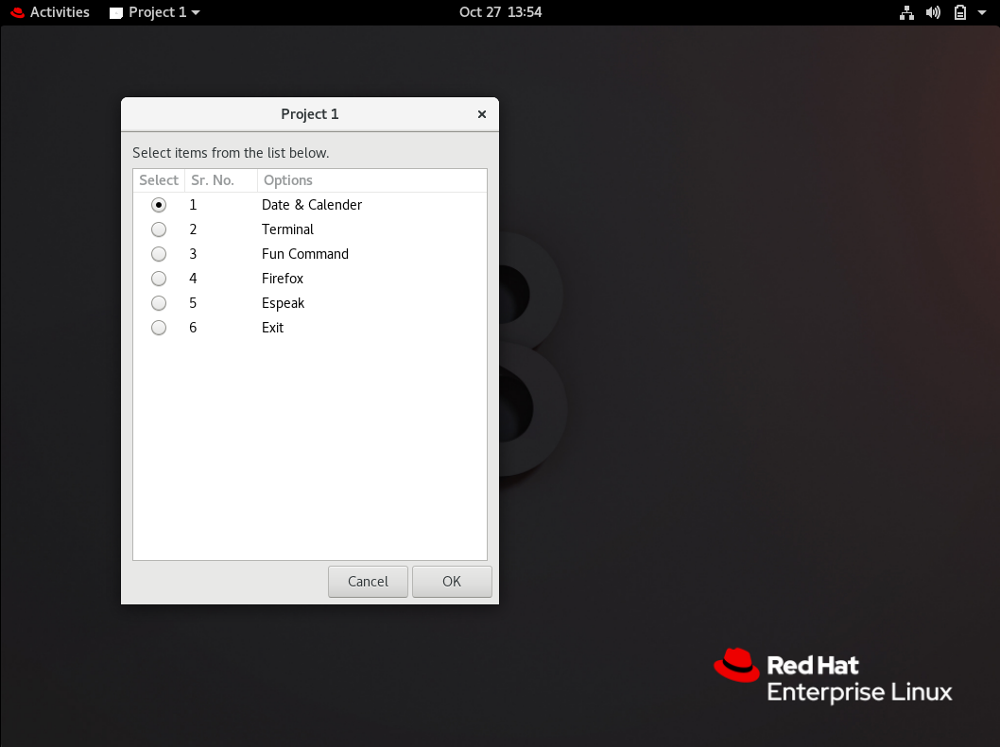
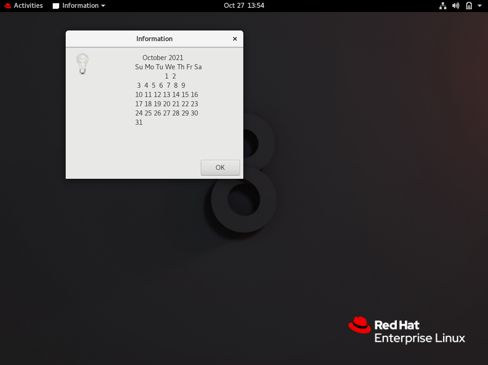
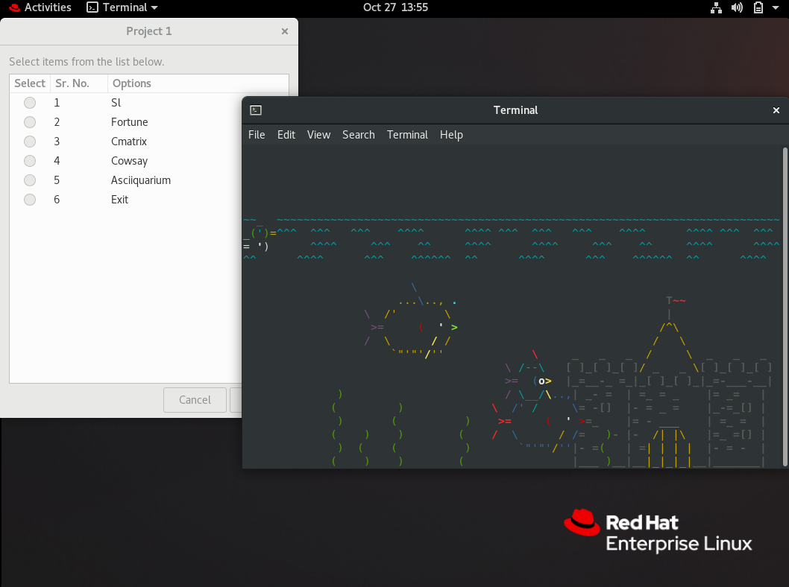
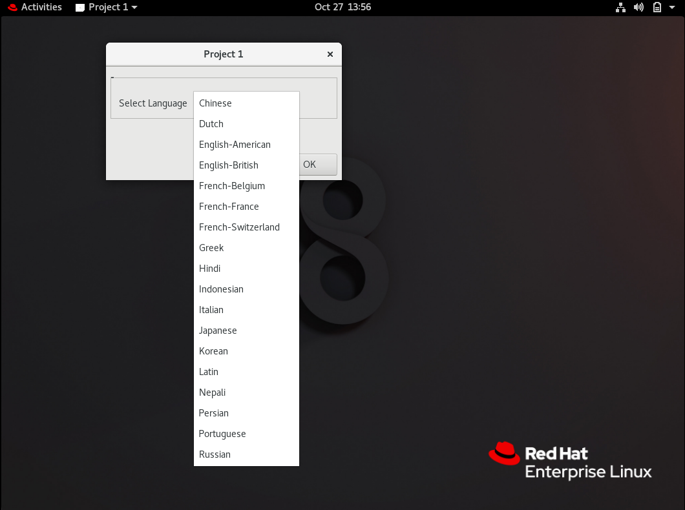

# ARTH 2.0 PROJECT 1

<br>

## Task Discription 📄

📌 Create Python Menu based program, integrate it with
espeak-ng and keep adding options as we learn new tools and
technologies.

<br>

---

<span style="color:red"><b>Note:</b></span>

This program work for linux only.

---

<br>

## How to Run Program.

<br>

1. Clone the repository
```bash
git clone https://github.com/shubranshugupta/Arth2.0-Project.git
```

2. Change Directory to Project1
```bash
cd Project1
```

3. Run the project1.py file.
```bash
python3 main.py
```

<br>

### Sample Image:

<br>








